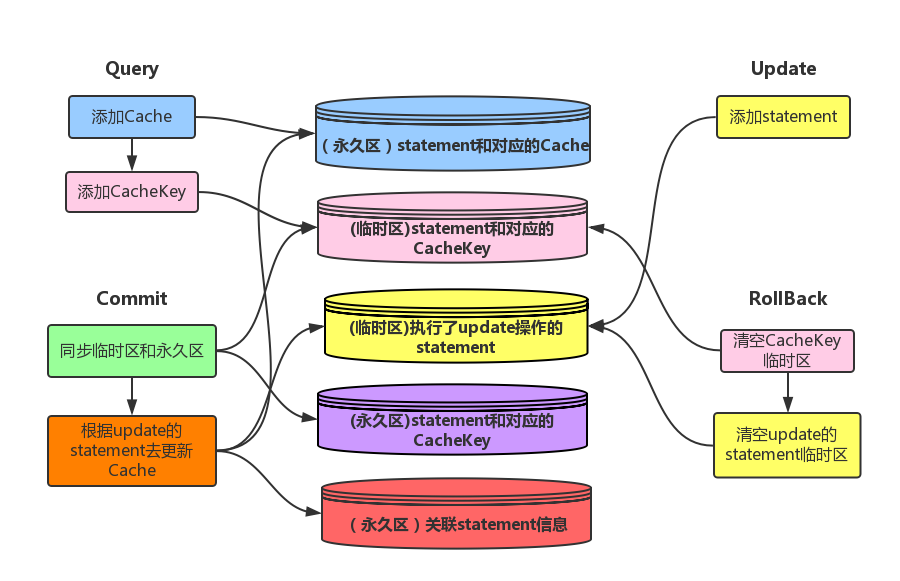

###基于redis的mybatis二级缓存插件
***
####简介
使用redis作为mybatis的缓存介质，通过使用mybatis的拦截器，在SQL执行的过程中，检查各个Mapper的二级缓存中过期的部分，匹配成功后删除过期的缓存，保证缓存的实时正确性。

####使用

#####添加redis的配置文件
下面是一份properties文件，将它放置在src包下即可，我的FileUtile类就可以找到。这份是一个包含整个所可以配置的东西，根据自己项目的需求抽取对应的配置整理成properties文件即可。
```properties
#redis的基础配置
redis.base.ip=127.0.0.1
redis.base.port=6379
redis.base.auth=xujianguo
#redis的对象池配置
#可用连接实例的最大数目，默认值为8
redis.pool.maxActive=1024
#控制一个pool最多有多少个状态为idle(空闲的)的jedis实例，默认值也是8
redis.pool.maxIdle=200
#等待可用连接的最大时间，单位毫秒，默认值为-1，表示永不超时。如果超过等待时间，则直接抛出JedisConnectionException
redis.pool.maxWait=10000
#连接超时时间
redis.pool.timeout=10000
#是否开启shard分布式模式
redis.shard.enable=false
#主机one的配置
redis.shard.one.ip=127.0.0.1
redis.shard.one.port=6379
redis.shard.one.auth=xujianguo
#主机two的配置
redis.shard.two.ip=127.0.0.1
redis.shard.two.port=6378
redis.shard.two.auth=xujianguo
#线程数控制
redis.limiter.limit=100000
```

#####二级缓存的关联配置
解决Mapper之间二级缓存的过期文件，就是通过一份关联配置来实现的，observers配置的是一个观察者，观察着statement的变化，statement的缓存更新了，就通过观察者，观察者立刻更新缓存，从而保证获取到是最新的数据。
```xml
<?xml version="1.0" encoding="UTF-8"?>
<dependencies>
   <statements>
       <statement id="com.xujianguo.dao.PersonDao.findById">
          <observer id="com.xujianguo.dao.UserDao.findOne"/>
       </statement>
   </statements>
</dependencies>
```
这个是上面xml的dtd文件，大家可以根据这个进行配置xml元素
```xml
<?xml version="1.0" encoding="UTF-8" ?>
<!ELEMENT dependencies (statements?)>
<!ELEMENT statements (statement*)>
<!ELEMENT statement (observer+)>
<!ELEMENT statement EMPTY>
<!ATTLIST statement id CDATA #REQUIRED>
<!ELEMENT observer EMPTY>
<!ATTLIST observer id CDATA #REQUIRED>
```

#####使用指定二级缓存
首先在mybatis的核心xml中配置好下面的全局设置，目的是开启mybatis的二级缓存
```xml
	<!-- 指定Mybatis使用log4j -->
	<settings>
		<setting name="cacheEnabled" value="true"/>
	</settings>
```
在mapper中配置二级缓存，执行我们的RedisCache作为缓存的实现类
```xml
<?xml version="1.0" encoding="UTF-8" ?>
<!DOCTYPE mapper
PUBLIC "-//ibatis.apache.org//DTD Mapper 3.0//EN"
"http://ibatis.apache.org/dtd/ibatis-3-mapper.dtd">
<mapper namespace="com.xujianguo.dao.PersonDao">
	<cache eviction="LRU" type="com.xujianguo.cache.RedisCache"/>

	<select id="findById" parameterType="int" resultMap="PersonMap" useCache="true">
		select * from person where id=#{id}
	</select>
</mapper>
```
这样就可以实现我们的最终目的了。

####设计及实现

#####拦截器中实现缓存更新
我们在CacheHandlerIntercept这个核心拦截器中拦截了四类method，query/update/commit/rollback，分别对应查询/更新/提交/回滚四类操作，下面这幅图展示了四类操作是如何对缓存进行更新的。


#####基于Redis的二级缓存实现
**RedisCache：**实现了Cache接口，提供基本的获取缓存/移除缓存等方法，内置了一个RedisPool的连接池，用于获取跟Redis进行通讯的连接。
```java
public class RedisCache implements Cache {
	private static Logger log = Logger.getLogger(RedisCache.class);
	//id属性只是一个名字标识，就像PerpetualCache里面的id被BaseExecutor设置为LocalCache
	private String id;
	//读写锁，这个必须提供，Executor调用Cache的时候就加锁
	private ReadWriteLock readWriteLock = new ReentrantReadWriteLock();
	//对象池
	private RedisPool pool;

    /* others */
}
```
**RedisPool：**里面有Config和Limiter两个重要的类，Config主要是去加载properties文件去获取对应的连接池配置和其他重要配置，Limiter是一个线程控制器，防止高并发下机器瘫痪。其他就是获取连接和释放连接的基本方法了。
```java
public class RedisPool {
	private static Logger log = Logger.getLogger(RedisPool.class);
	//单例模式
	private static RedisPool pool;
	//真实使用的池
	private Pool realPool;
	//线程控制器
	private Limiter limiter;
	//配置
	private Config config;

    /* others */
}
```
**Config：**首先遍历搜索properties文件，找到后就通过反射加载配置文件，原理是通过反射类的属性，然后去正则匹配对应的properties的key，接着反射创建类的实例，设置对应的value，这个是核心思想。
```java
public class Config {
	//基本配置
	private RedisBase base;
	//对象池的配置
	private RedisPool pool;
	//分片的配置
	private RedisShard shard;
	//线程控制参数
	private LimiterParam limiterParam;

	/**
	 * 加载对应的配置到对应的类中
	 */
	public Config() {
		PropertyParser parser = PropertyParser.getInstance();
		Properties pBase = parser.doFilter(new RegexFilter("^redis\\.base\\..*"));
		Properties pPool = parser.doFilter(new RegexFilter("^redis\\.pool\\..*"));
		Properties pShard = parser.doFilter(new RegexFilter("^redis\\.shard\\..*"));
		Properties pLimiter = parser.doFilter(new RegexFilter("^redis\\.limiter\\..*"));
		base = PropertyReflect.reflect(RedisBase.class, pBase);
		pool = PropertyReflect.reflect(RedisPool.class, pPool);
		shard = PropertyReflect.reflect(RedisShard.class, pShard);
		limiterParam = PropertyReflect.reflect(LimiterParam.class, pLimiter);
	}

    /* others */
}
```
**Limiter：**使用AQS框架的共享模式进行同步，设置一个limit值，达到超过limit值的时候进行阻塞，释放锁的时候limit值减1.
```java
public class Limiter {
	//日志记录
	private static final Logger log = Logger.getLogger(Limiter.class);
	
	//同步器
	private final Sync sync;
	//内部计数器
	private final AtomicLong count;
	//限制值
	private volatile long limit;
	
	//初始化
	public Limiter(long limit) {
		this.limit = limit;
		count = new AtomicLong(0);
		sync = new Sync();
	}
	
	/**
	 * 使用AQS框架的共享模式进行同步
	 * @author xujianguo
	 * @email ray_xujianguo@yeah.net
	 * @time 2015年3月31日
	 */
	@SuppressWarnings("serial")
	private class Sync extends AbstractQueuedSynchronizer {
		public Sync() {}
		
		/**
		 * 超过limit值进行阻塞
		 */
		@Override
		protected int tryAcquireShared(int arg) {
			long newValue = count.incrementAndGet();
			if(newValue > limit) {
				count.decrementAndGet();
				return -1;
			}
			return 1;
		}
		
		/**
		 * 减少limit
		 */
		@Override
		protected boolean tryReleaseShared(int arg) {
			count.decrementAndGet();
			return true;
		}
	}
	
	/**
	 * 限制
	 * @throws InterruptedException
	 */
	public void limit() throws InterruptedException {
		sync.acquireSharedInterruptibly(0);
	}
	
	/**
	 * 解除限制
	 * @return
	 */
	public boolean unlimit() {
		return sync.releaseShared(0);
	}
	
	/**
	 * 重置计数器
	 */
	public void reset() {
		count.set(0);
	}
}
```


